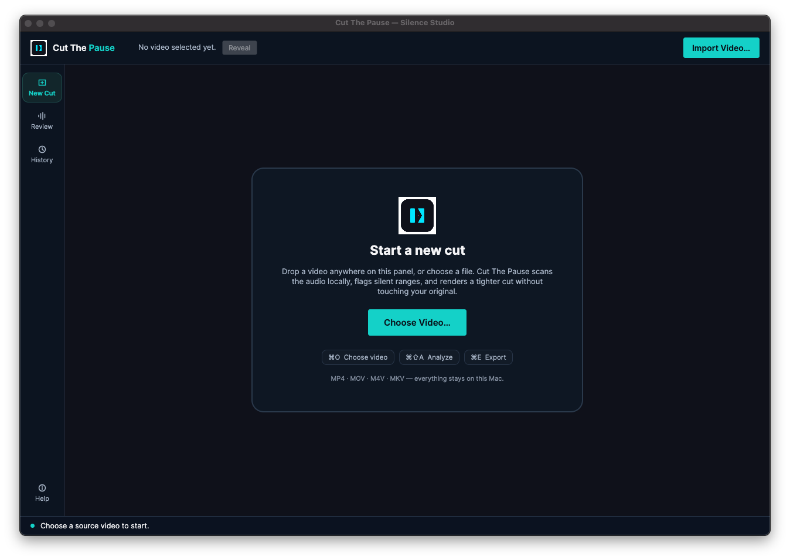
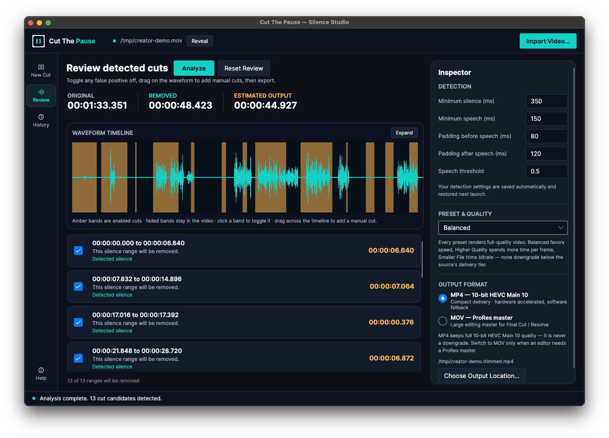
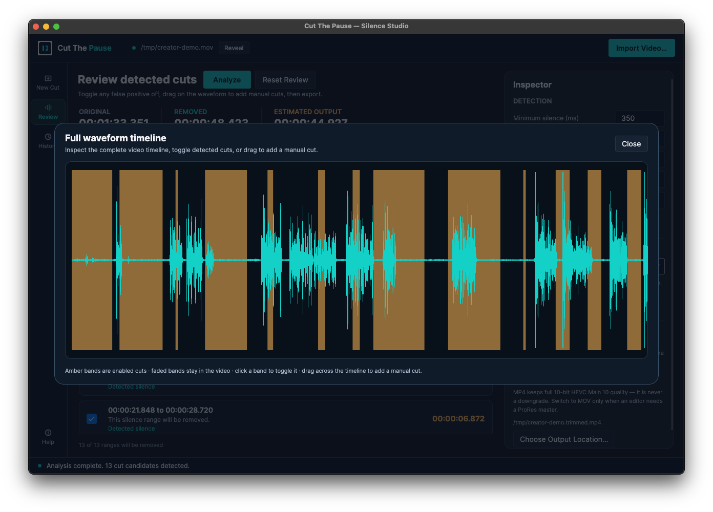

# Cut The Pause

## Keep the story. Lose the pause.

Cut The Pause is a local-first macOS app for creators who want the awkward
silence out of a talking-head video without handing their footage to a cloud
editor. Import an MP4 or MOV, let the app find speech gaps, review every
proposed cut, and export a cleaner video when it looks right.

<p align="center">
  <a href="https://github.com/AmrZakiiiii/cut-the-pause/releases/tag/v0.1.0-beta"><strong>Download the public beta</strong></a>
  · <a href="https://amrzakiiiii.github.io/cut-the-pause/">Visit the product website</a>
  · <a href="docs/INSTALL_MACOS.md">Install or build on macOS</a>
</p>

> **Beta platform:** Apple Silicon Macs (`arm64`) running macOS 13.0 or newer.
> The downloadable beta is unsigned and not notarized. Verify the published
> SHA-256 checksum, then in Finder use **right-click (or Control-click) → Open**
> on the app the first time. Do not disable Gatekeeper globally.

## See the review loop

The current desktop UI keeps the important decision visible: detected silence
is highlighted on a waveform, each candidate can be toggled, and the Inspector
keeps detection and output choices close at hand.



*Current app overview: import an MP4 or MOV, tune detection settings, and start
with a clear New Cut workspace.*



*Current analyzed review: waveform, detected cut bands, editable candidate list,
Inspector controls, and output choices in one workspace.*



*Current expanded timeline: inspect the complete waveform, toggle detected cuts,
or drag across the timeline to add a manual cut.*

## What you can do

- Analyze videos locally with the Silero VAD pipeline when its bundled model is
  available, with an energy-based detector fallback and a visible warning.
- Adjust minimum silence, minimum speech, speech threshold, and before/after
  padding instead of accepting a one-size-fits-all cut.
- Review every proposed range, disable false positives, and add or adjust
  manual ranges on the waveform before export.
- Save named custom presets and return to analysis/export history for repeat
  workflows.
- Export a compact 10-bit HEVC Main 10 MP4 for delivery, or choose a larger
  ProRes-based MOV master when an editing handoff needs it.
- Follow live export progress, cancel analysis or export safely, and pause an
  export for later resume from its saved checkpoint.
- Work with FFmpeg, FFprobe, and the Silero model bundled in the beta package;
  your video stays on your Mac in the documented desktop workflow.

## Download and install

1. Download both files from the [v0.1.0-beta release](https://github.com/AmrZakiiiii/cut-the-pause/releases/tag/v0.1.0-beta):
   `CutThePause-macos-arm64.zip` and its `.sha256` checksum.
2. Verify the archive before opening it:

   ```bash
   shasum -a 256 -c CutThePause-macos-arm64.zip.sha256
   ```

   The result must say `OK`.
3. Extract the ZIP, move `Cut The Pause.app` to `~/Applications` or
   `/Applications`, and use Finder **right-click → Open** on first launch.

The [macOS beta install and source-build guide](docs/INSTALL_MACOS.md) covers
the complete package layout, troubleshooting, bundled dependencies, and the
unsigned/notarization warning. Intel Macs are not a supported target for this
beta package.

## Build from source

On an Apple Silicon Mac with .NET 8, Xcode Command Line Tools, Homebrew, and
FFmpeg available:

```bash
dotnet restore CutThePause.sln
dotnet build CutThePause.sln --configuration Release --no-restore
dotnet run --project src/CutThePause.App/CutThePause.App.csproj --configuration Release
```

Run the primary detector with the optional model download:

```bash
./scripts/download-silero-model.sh
```

Without the model, the app uses its built-in energy detector and reports the
fallback. The [source-build section of the install guide](docs/INSTALL_MACOS.md#source-build-on-macos)
has the release-runtime publish, package, and smoke-test commands.

## Project and quality notes

The app is built with Avalonia and .NET 8:

- `src/CutThePause.App` — desktop UI, review workflow, history, presets, and
  export presentation.
- `src/CutThePause.Core` — timeline models and cut planning.
- `src/CutThePause.Infrastructure` — FFmpeg integration, metadata extraction,
  and VAD adapters.
- `tests` — Core, Infrastructure, and App tests, including FFmpeg command and
  real-video smoke coverage where the sample media is available.

The release workflow validates the three test projects, restores the
`osx-arm64` runtime explicitly, publishes without a second restore, packages
the unsigned app, writes a checksum, and runs the macOS package smoke test.
There is no signing or notarization step.

## Support and licensing

- [Report a bug or request help](https://github.com/AmrZakiiiii/cut-the-pause/issues)
- [MIT license](LICENSE)
- [Commercial licensing and supporter terms](docs/COMMERCIAL_LICENSING.md)
- [Third-party notices for FFmpeg, Silero VAD, and runtime dependencies](THIRD_PARTY_NOTICES.md)
- [Product website](https://amrzakiiiii.github.io/cut-the-pause/)

Cut The Pause is open-source software provided “as is.” The repository license
does not replace the separate licenses and notices for bundled third-party
components.
