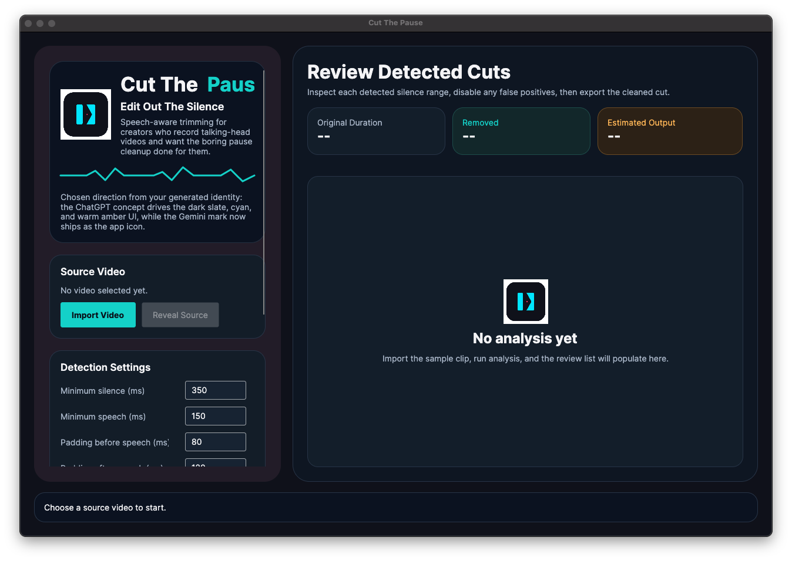
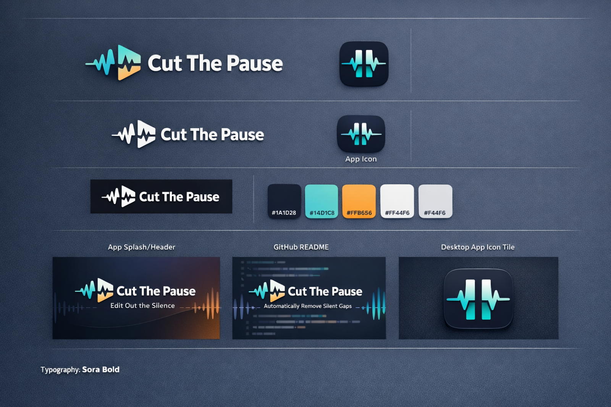

# Cut The Pause

Cut The Pause is a mac-first desktop app for solo creators who are tired of manually trimming awkward silence between spoken lines. It analyzes a video, detects speech gaps, lets you review the proposed cuts, and exports a cleaned version with the quiet sections removed.



## Showcase

- Desktop app overview:
  - the current macOS build with the review-first trimming UI
- Visual identity board:
  - the agreed brand direction that informs the app colors, icon, and README presentation



## Visual Identity

- The product direction is dark slate, electric cyan, and warm amber.
- The in-app UI follows the stronger ChatGPT concept board: timeline rhythm, pause removal, and creator-tool clarity.
- The shipped app icon uses the simplified Gemini mark adapted into the macOS bundle and in-app branding surfaces.
- Primary palette in the app:
  - `#0F111A` base
  - `#131D28` panel
  - `#14D1C8` accent
  - `#FFB656` action highlight
  - `#F4F4F6` text

## Current Scope

- Import a single MP4 or MOV file.
- Detect speech gaps with a Silero VAD ONNX pipeline when the model is available.
- Fall back to an energy-based detector when the ONNX model is missing.
- Review each detected cut and disable any false positives before export.
- Export a trimmed MP4 for fast delivery or a high-quality MOV ProRes master for editing workflows.
- Show a dedicated export progress overlay with real FFmpeg percentage updates while rendering.

## Performance

- On macOS, exports now prefer `h264_videotoolbox` for hardware-accelerated H.264 encoding.
- If VideoToolbox export fails, the app automatically falls back to software `libx264`.
- `.mov` exports use a ProRes-based master path so quality stays editor-friendly instead of forcing everything through a delivery codec.
- Software presets were tuned for faster iteration:
  - `Balanced`: `libx264` `veryfast`
  - `SmallerFile`: `libx264` `faster`
  - `HigherQuality`: `libx264` `fast`
- The real sample clip in `Real Test Video/IMG_0278.MOV` is covered by a smoke test so analysis and export are checked against an actual talking-head source, not only synthetic fixtures.

## Repository Layout

- `src/CutThePause.App`: Avalonia desktop UI.
- `src/CutThePause.Core`: timeline models and cut-planning logic.
- `src/CutThePause.Infrastructure`: FFmpeg integration, metadata extraction, and VAD adapters.
- `tests`: unit tests for planning, fallback detection, and FFmpeg command generation.

## Local Development

1. Install .NET 8.
2. Install FFmpeg and make sure `ffmpeg` and `ffprobe` are on your `PATH`, or set `CUTTHEPAUSE_FFMPEG_PATH` and `CUTTHEPAUSE_FFPROBE_PATH`.
3. Optionally download the Silero model:

   ```bash
   ./scripts/download-silero-model.sh
   ```

4. Restore and run:

   ```bash
   dotnet restore CutThePause.sln
   dotnet run --project src/CutThePause.App/CutThePause.App.csproj
   ```

If the Silero model is not present, the app still works with the built-in energy detector and shows a warning in the review panel.

### Launch The Packaged App

```bash
open "/Users/amrzaky/Desktop/Video Silence Removal/artifacts/release/Cut The Pause.app"
```

If macOS blocks the bundle because it is unsigned, right-click the app once in Finder and choose `Open`.

## Packaging

- CI runs on macOS.
- Release packaging creates a zipped `.app` bundle.
- The release workflow bundles FFmpeg binaries and can include the Silero ONNX model when it is downloaded into `assets/models/`.
- The macOS bundle now includes the branded `.icns` icon, `ffmpeg`, `ffprobe`, and the Silero model when available.

## Verification

- Desktop app build succeeds on macOS.
- Core tests pass.
- Infrastructure tests pass.
- FFmpeg builder coverage now checks both `mp4` and `mov` export paths.
- Real-video smoke coverage validates analyze plus export using the provided sample clip.

## License

The repository is licensed under MIT. FFmpeg and the Silero VAD model remain subject to their own licenses; see [THIRD_PARTY_NOTICES.md](/Users/amrzaky/Desktop/Video Silence Removal/THIRD_PARTY_NOTICES.md).
